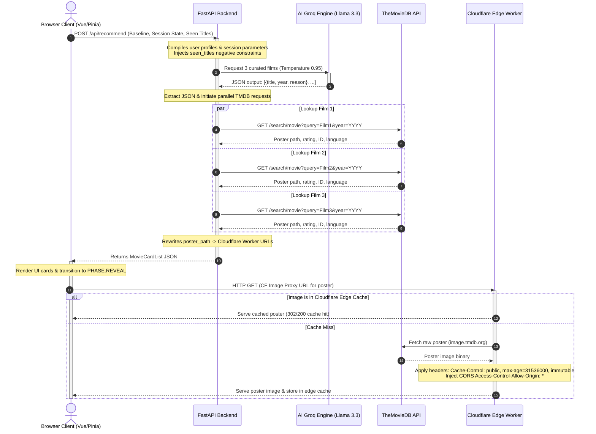
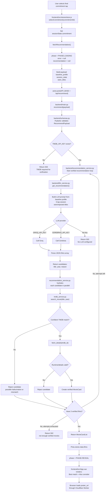
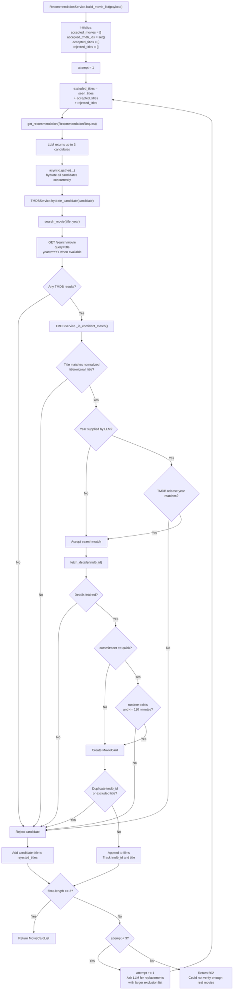
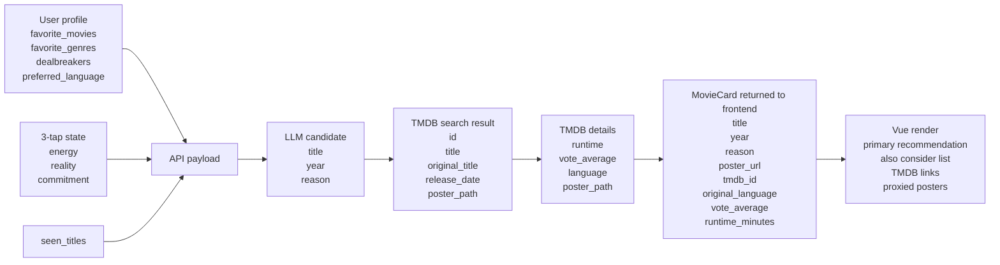
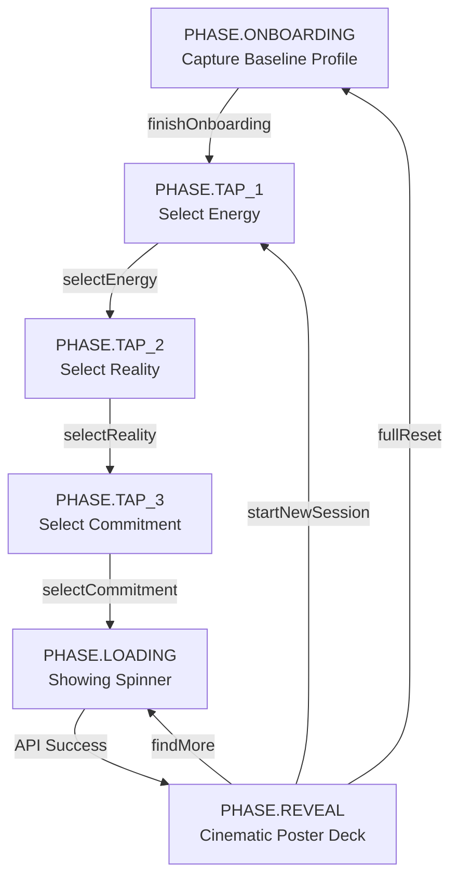
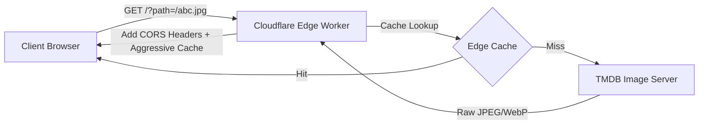

# Inside Socrates Screen: Deep Technical Curation Engine

Socrates Screen is an AI-driven, hyper-personalized movie curation application. Unlike generic recommendation engines that rely on static collaborative filtering or basic genre tags, Socrates Screen decodes a user's **current psychological state** and intersects it with their **persistent baseline preferences** to recommend exactly **3 perfect films** from the entire canvas of global cinema.

This document provides a highly comprehensive, step-by-step technical breakdown of how the frontend, backend, and Cloudflare Edge Proxy function together.

---

## 1. Directory Structure

The project is structured into three clean, isolated modules to maintain clear boundaries between the frontend application, the API backend, and the serverless edge worker.

```text
socrates-screen/
├── backend/                  # FastAPI Application Layer
│   ├── .env                  # API keys and endpoint variables
│   ├── main.py               # FastAPI app wiring and route handlers
│   ├── config.py             # Environment-backed settings
│   ├── http_client.py        # Shared async HTTP client lifecycle
│   ├── schemas.py            # Request and response Pydantic models
│   ├── llm_service.py        # LLM client integration, prompts, JSON extractors
│   ├── tmdb_service.py       # TMDB search, validation, details, poster URLs
│   ├── recommendation_service.py # LLM/TMDB orchestration and retry loop
│   └── requirements.txt      # Python dependencies
├── frontend/                 # Vue 3 UI Layer (Vite + Pinia)
│   ├── src/
│   │   ├── stores/
│   │   │   └── store.js      # Pinia State Store (baseline & session management)
│   │   ├── App.vue           # Cinematic single-page UI container
│   │   ├── main.js           # Vue mounting and bootstrapping
│   │   └── style.css         # Modern typography and glassmorphic aesthetics
│   ├── vite.config.js        # Vite build tool and development server configuration
│   └── package.json          # Node dependencies and build scripts
└── worker/                   # Cloudflare Edge Worker Layer
    ├── index.js              # Serverless TMDB image proxy & aggressive cache
    └── wrangler.toml         # Cloudflare Deployment configuration
```

---

## 2. Architecture & Data Flow

The system operates as an asynchronous pipeline. Below is a structural map of how requests originate from the browser, process through the backend, consult the LLM and the TMDB database, and leverage the Cloudflare Edge Cache.



---

## 3. Data Schemas & API Payloads

The communication boundary between the frontend and backend is strictly typed using Pydantic V2 models on the server side and reactive JSON structures on the client.

### Request Payload (`POST /api/recommend`)
Sent by the Pinia store when the user completes their third selection tap.

```json
{
  "baseline_profile": {
    "favorite_movies": ["Inception", "Kumbalangi Nights", "3 Idiots"],
    "favorite_genres": ["Sci-Fi", "Drama", "Thriller"],
    "dealbreakers": ["gore", "horror"],
    "preferred_language": "any"
  },
  "session_state": {
    "energy": "think",
    "reality": "escapism",
    "commitment": "quick"
  },
  "seen_titles": ["Interstellar", "Coherence"]
}
```

### Response Payload (`MovieCardList`)
Returned by FastAPI after LLM extraction, parallel TMDB search, and edge URL transformation.

```json
{
  "films": [
    {
      "title": "Ex Machina",
      "year": "2014",
      "reason": "An intensely cerebral and grounded thriller under two hours that explores the boundaries of artificial intelligence. It perfectly matches your desire to think while offering a highly atmospheric escape.",
      "poster_url": "https://socrates-image-proxy.example.workers.dev/?path=%2F8naVv2Xu3rWI5JKHz0vCujx6GaJ.jpg",
      "tmdb_id": 264660,
      "original_language": "en",
      "vote_average": 7.6,
      "runtime_minutes": 108
    },
    {
      "title": "Primer",
      "year": "2004",
      "reason": "A mind-bending puzzle box of a time-travel film. Clocking in at a tight 77 minutes, it offers a cerebral workout that will leave you tracing timelines long after it ends.",
      "poster_url": "https://socrates-image-proxy.example.workers.dev/?path=%2F5sV6dJjBshvV92kU6k3yP21j1Uv.jpg",
      "tmdb_id": 14337,
      "original_language": "en",
      "vote_average": 6.9,
      "runtime_minutes": 77
    },
    {
      "title": "The Man from Earth",
      "year": "2007",
      "reason": "A brilliant chamber drama that takes place entirely in a single cabin. It is a profound, high-concept conversational movie that stretches the mind without needing a single special effect.",
      "poster_url": "https://socrates-image-proxy.example.workers.dev/?path=%2F2WbZ37i8mI4tF4PuxqA7xJm70fB.jpg",
      "tmdb_id": 13342,
      "original_language": "en",
      "vote_average": 7.7,
      "runtime_minutes": 87
    }
  ]
}
```

---

## 4. Detailed Working: How the Movie List Is Fetched

The movie list shown in Socrates Screen is not fetched as a pre-existing catalogue from TMDB. The system first **generates a personalized list of 3 movie titles using the LLM**, then uses TMDB as a metadata lookup service for those generated titles. This distinction is important:

* **LLM responsibility:** Decide which 3 movies fit the user's mood, preferences, language, dealbreakers, and session history.
* **TMDB responsibility:** Confirm and enrich each title with poster path, TMDB id, original language, and vote average.
* **Frontend responsibility:** Trigger the request, store the returned `films` array, and render the list as one primary pick plus two supporting picks.

### Code Flow Overview

This chart shows how the main code modules hand work to each other from the final user tap to the rendered movie cards.



### Backend Verification and Retry Flow

The backend treats LLM output as untrusted candidate data. A movie only reaches the frontend after it survives every verification step below.



### Data Shape Through the Pipeline

The same recommendation changes shape as it moves through the system:



### Step 1: User Input Becomes Frontend State

The frontend keeps two categories of state in `frontend/src/stores/store.js`:

1. `baselineProfile`: persistent user taste data saved in `localStorage`.
2. `sessionState`: the current 3-tap mood selection for this recommendation run.

The baseline profile contains:

```javascript
{
  favorite_movies: [],
  favorite_genres: [],
  dealbreakers: [],
  preferred_language: "any"
}
```

The session state contains:

```javascript
{
  energy: null,
  reality: null,
  commitment: null
}
```

As the user moves through the 3-tap flow, Pinia updates the state:

```javascript
function selectEnergy(energyId) {
  sessionState.value.energy = energyId;
  phase.value = PHASE.TAP_2;
}

function selectReality(realityId) {
  sessionState.value.reality = realityId;
  phase.value = PHASE.TAP_3;
}

async function selectCommitment(commitmentId) {
  sessionState.value.commitment = commitmentId;
  await fetchRecommendation();
}
```

The final tap is the trigger point. Once `commitment` is selected, the frontend immediately calls `fetchRecommendation()`.

### Step 2: Pinia Builds the API Payload

`fetchRecommendation()` is the core frontend function responsible for asking the backend for a movie list. Before making the request, it moves the app into the loading phase and clears any stale recommendation:

```javascript
phase.value = PHASE.LOADING;
error.value = null;
recommendation.value = null;
```

It then builds the payload:

```javascript
const payload = {
  baseline_profile: baselineProfile.value,
  session_state: {
    energy: sessionState.value.energy,
    reality: sessionState.value.reality,
    commitment: sessionState.value.commitment,
  },
  seen_titles: [...seenTitles.value],
};
```

This payload is sent to the FastAPI backend:

```javascript
const { data } = await axios.post(`${API_BASE}/api/recommend`, payload, {
  timeout: 30000,
  headers: { "Content-Type": "application/json" },
});
```

In local development, `API_BASE` defaults to:

```javascript
http://localhost:8000
```

So the actual request becomes:

```text
POST http://localhost:8000/api/recommend
```

### Step 3: FastAPI Validates the Request

The backend receives the request in `backend/main.py`:

```python
@app.post("/api/recommend", response_model=MovieCardList, tags=["recommendations"])
async def recommend(payload: RecommendPayload) -> MovieCardList:
    return await recommendation_service.build_movie_list(payload)
```

The request body is defined in `backend/schemas.py` and validated through Pydantic:

```python
class RecommendPayload(BaseModel):
    baseline_profile: BaselineProfile
    session_state: SessionState
    seen_titles: list[str] = Field(default_factory=list)
```

If the frontend sends malformed data, FastAPI rejects the request before the recommendation pipeline runs. If the payload is valid, `backend/recommendation_service.py` owns the orchestration: it builds exclusion lists, asks the LLM for candidates, asks TMDB to verify each candidate, retries when candidates fail, and finally returns `MovieCardList`.

```python
return await recommendation_service.build_movie_list(payload)
```

### Step 4: The LLM Generates the Actual Movie List

The first real source of the movie list is `backend/llm_service.py`, not TMDB. The backend calls:

```python
async def get_recommendation(req: RecommendationRequest) -> list[RecommendationOutput]:
```

This function checks which LLM provider is configured:

```python
use_groq = bool(os.environ.get("GROQ_API_KEY"))
use_cerebras = bool(os.environ.get("CEREBRAS_API_KEY"))
```

If `GROQ_API_KEY` exists, Groq is used. Otherwise, Cerebras is used when `CEREBRAS_API_KEY` exists. If neither exists, the backend returns a service error because it cannot generate recommendations.

The prompt combines:

* user's favourite movies
* preferred genres
* dealbreakers
* preferred language
* selected energy
* selected reality mode
* selected commitment/runtime preference
* already recommended `seen_titles`

The prompt asks the model to return exactly this shape:

```json
{
  "films": [
    { "title": "Movie Title 1", "year": "YYYY", "reason": "..." },
    { "title": "Movie Title 2", "year": "YYYY", "reason": "..." },
    { "title": "Movie Title 3", "year": "YYYY", "reason": "..." }
  ]
}
```

The response is parsed with `_extract_json()`, which strips accidental Markdown fences and extracts the JSON object:

```python
cleaned = re.sub(r"```(?:json)?", "", raw).strip()
match = re.search(r"\{.*\}", cleaned, re.DOTALL)
return json.loads(match.group(0))
```

Finally, only the first 3 films are returned:

```python
return [
    RecommendationOutput(
        title=f.get("title", "Unknown"),
        year=str(f.get("year", "")),
        reason=f.get("reason", ""),
    )
    for f in films_raw[:3]
]
```

At this point, the backend has a movie list with only:

```text
title, year, reason
```

There is still no poster, TMDB link, rating, or language metadata.

### Step 5: Backend Searches TMDB for Each Generated Movie

After the LLM returns candidate titles, `backend/recommendation_service.py` asks `backend/tmdb_service.py` to verify them in parallel:

```python
hydrated_movies = await asyncio.gather(
    *[
        self.movie_service.hydrate_candidate(candidate, payload.session_state)
        for candidate in candidates
    ]
)
```

`asyncio.gather()` runs all candidate checks concurrently. This matters because the backend does not wait for movie 1 before starting movie 2 and movie 3. All TMDB requests are in flight at the same time.

Each candidate first calls `search_movie(title, year)`:

```python
response = await client.get(
    f"{self.settings.tmdb_base_url}/search/movie",
    params=params,
    headers=headers,
)
```

The request parameters include:

```python
params = {
    "query": title,
    "include_adult": "false",
    "language": "en-US",
    "page": "1",
}
```

If the LLM supplied a numeric year, it is added to narrow the match:

```python
if year and year.isdigit():
    params["year"] = year
```

The backend supports both TMDB authentication styles:

* v3 API key: sent as `api_key` query parameter.
* v4 bearer token: sent as `Authorization: Bearer <token>`.

The function does not blindly trust the first TMDB result. It checks the returned candidates and only accepts a confident match:

```python
results = data.get("results", [])
for result in results:
    if self._is_confident_match(title, year, result):
        return result
```

The confidence check compares normalized title variants and, when the LLM supplied a year, rejects results with a mismatched TMDB release year. After search validation, the backend fetches `/movie/{tmdb_id}` details to verify authoritative metadata such as runtime. If TMDB returns no confident result, the details request fails, or a `quick` recommendation is over 110 minutes, that candidate is rejected. The backend asks the LLM for replacement candidates and tries again instead of returning an unverified movie to the UI.

### Step 6: Poster Paths Are Rewritten Through Cloudflare

TMDB returns poster paths in relative form:

```text
/8naVv2Xu3rWI5JKHz0vCujx6GaJ.jpg
```

The backend does not send raw `image.tmdb.org` URLs to the frontend. Instead, `TMDBService.poster_url()` rewrites each poster path into a Cloudflare Worker URL:

```python
def poster_url(self, poster_path: str) -> str:
    worker_base = self.settings.cloudflare_worker_url.rstrip("/")
    encoded_path = quote(poster_path, safe="/")
    return f"{worker_base}/?path={encoded_path}"
```

This produces a URL like:

```text
https://socrates-image-proxy.example.workers.dev/?path=/8naVv2Xu3rWI5JKHz0vCujx6GaJ.jpg
```

The Worker later fetches the actual image from TMDB's image CDN and returns it with cache and CORS headers.

### Step 7: Backend Assembles the Final `MovieCardList`

`TMDBService._to_movie_card()` merges the LLM reason and the TMDB details into one frontend-ready object:

```python
return MovieCard(
    title=details.get("title") or tmdb_data.get("title") or candidate.title,
    year=release_year(details) or release_year(tmdb_data) or candidate.year,
    reason=candidate.reason,
    poster_url=poster_url,
    tmdb_id=tmdb_data.get("id"),
    original_language=details.get("original_language")
    or tmdb_data.get("original_language"),
    vote_average=details.get("vote_average") or tmdb_data.get("vote_average"),
    runtime_minutes=details.get("runtime"),
)
```

The final response shape is:

```json
{
  "films": [
    {
      "title": "Ex Machina",
      "year": "2014",
      "reason": "...",
      "poster_url": "https://worker-url/?path=/poster.jpg",
      "tmdb_id": 264660,
      "original_language": "en",
      "vote_average": 7.6,
      "runtime_minutes": 108
    }
  ]
}
```

This is the complete movie list payload consumed by the frontend.

### Step 8: Frontend Stores and Renders the Movie List

After the API returns successfully, Pinia stores the list:

```javascript
recommendation.value = data.films;
phase.value = PHASE.REVEAL;
```

`App.vue` reads `store.recommendation` and renders:

* `store.recommendation[0]` as the main "Best match" card.
* `store.recommendation.slice(1)` as the "Also consider" list.

For the main pick, the poster is rendered from `poster_url`:

```vue

```

If the poster fails, the UI falls back to a placeholder. If `tmdb_id` exists, the movie title becomes a clickable TMDB link:

```vue
<a
  v-if="store.recommendation[0].tmdb_id"
  :href="`https://www.themoviedb.org/movie/${store.recommendation[0].tmdb_id}`"
  target="_blank"
  rel="noopener noreferrer"
>
  {{ store.recommendation[0].title }}
</a>
```

### Step 9: "Find 3 More" Uses the Same Pipeline With Exclusions

When the user asks for more recommendations, the frontend adds the currently displayed titles into `seenTitles`:

```javascript
for (const film of recommendation.value) {
  if (!seenTitles.value.includes(film.title)) {
    seenTitles.value.push(film.title);
  }
}
```

Then it calls `fetchRecommendation()` again. The next payload contains those titles in `seen_titles`, and the LLM prompt includes a strong instruction not to repeat them.

The pipeline is otherwise identical:

```text
Find More -> seen_titles grows -> POST /api/recommend -> LLM picks 3 different titles -> TMDB hydrates metadata -> frontend renders new list
```

### Failure Behavior

The pipeline is designed to degrade gracefully:

* If the LLM provider is missing, `/api/recommend` returns a `503` error.
* If the LLM call fails unexpectedly, `/api/recommend` returns a `500` error.
* If TMDB lookup fails for one movie, that candidate is rejected and the backend retries for replacements.
* If the backend cannot verify 3 real movies after the configured retry attempts, `/api/recommend` returns a `502` error.
* If a poster image fails to load, the frontend displays a fallback poster placeholder.
* If the whole API request fails, the frontend stores a readable error message, resets the session taps, and returns to `PHASE.TAP_1`.

---

## 5. The Frontend Layer (Vue 3 + Pinia)

The frontend orchestrates the visual state machine and holds the user preferences in persistent browser storage.

### Persistent Baseline Profile
During onboarding, the user registers their baseline taste. Pinia maps this to a persistent `localStorage` object under the key `socrates_baseline_v1`. 

* **Store File:** `frontend/src/stores/store.js`
* **Loading & Saving:** The helper `loadBaseline()` retrieves the saved JSON on store initialization. When onboarding is complete, `finishOnboarding()` invokes `saveProfile()`, storing the configurations permanently so users skip onboarding on subsequent visits.

### Ephemeral Session State
A 3-axis selector maps the psychological and temporal constraints:
1. **Energy** (`think` | `brain_off` | `feel`): Maps to cognitive processing desires.
2. **Reality** (`grounded` | `escapism`): Determines literal/realist versus fantasy/speculative environments.
3. **Commitment** (`quick` | `epic`): Limits or expands runtimes (under 110 mins vs. 130+ mins).

### The UI State Machine
The client switches UI states seamlessly using the reactive `phase` variable, ensuring clean division of labor:



### Seen Titles Deduplication Loop
To prevent the user from receiving repetitive recommendations in the same session, the frontend keeps an active array `seenTitles` in store memory.

* When the user clicks **"Find 3 More"**, the action `findMore()` is invoked:
  ```javascript
  async function findMore() {
    if (recommendation.value?.length) {
      for (const film of recommendation.value) {
        if (!seenTitles.value.includes(film.title)) {
          seenTitles.value.push(film.title);
        }
      }
    }
    await fetchRecommendation();
  }
  ```
* These titles are included in the request payload as `seen_titles`. This persistent exclusion array grows dynamically during the session.

---

## 6. The Backend Layer (FastAPI + Groq / Cerebras)

The backend provides the API service layer. It decodes user states, communicates with high-performance LLMs, verifies candidates through TMDB, and crafts custom image proxy targets. The refactored backend separates these responsibilities:

* `main.py`: FastAPI app wiring, health check, and route handlers.
* `config.py`: environment-backed settings.
* `http_client.py`: shared `httpx.AsyncClient` lifecycle.
* `schemas.py`: API request and response models.
* `llm_service.py`: prompt construction, provider calls, JSON parsing.
* `tmdb_service.py`: TMDB search, confidence checks, details fetches, poster URL rewriting.
* `recommendation_service.py`: retry loop that turns LLM candidates into verified movie cards.

### Connection Pooling & Lifespan
Because recommendations happen dynamically, opening a new HTTP connection for each metadata query would add hundreds of milliseconds of latency.
* The API utilizes FastAPI's `lifespan` manager and `backend/http_client.py` to initialize a single, high-performance `httpx.AsyncClient` with connection pooling limits:
  ```python
  _http_client = httpx.AsyncClient(
      timeout=httpx.Timeout(10.0, connect=5.0),
      limits=httpx.Limits(max_keepalive_connections=20, max_connections=50),
  )
  ```
* This client is shared across all TMDB API searches, guaranteeing ultra-low-latency keep-alive connections.

### AI Engine Curation & Negative Constraints
The LLM (by default, LLaMA 3.3 70B on Groq or LLaMA 3.1 70B on Cerebras) acts as an opinionated film curator.
* **Negative Constraints Integration:** To make the LLM respect the `seen_titles` array, the system dynamically appends a loud directive inside `llm_service.py`:
  ```text
  CRITICAL INSTRUCTION - ALREADY SEEN FILMS:
  The user has already been recommended the following films in this session:
  - Film A
  - Film B
  
  DO NOT recommend these films again. You MUST pick 3 completely different films. If you repeat any of the films listed above, you have failed your objective.
  ```
* **Forcing Creativity:** To guarantee that the LLM does not get stuck in a structural loop, the API generation temperature is bumped to `0.95`. This provides high randomness and diverse choices while ensuring output conforms to the structured JSON template via `response_format={"type": "json_object"}`.

### Parallel Metadata Hydration (`asyncio.gather`)
The LLM only knows titles and years. To verify candidates and retrieve poster paths, ratings, runtime, and language metadata, the backend hydrates candidates concurrently:

```python
hydrated_movies = await asyncio.gather(
    *[
        self.movie_service.hydrate_candidate(candidate, payload.session_state)
        for candidate in candidates
    ]
)
```
Rather than validating candidates sequentially (which would take $3 \times \text{RTT}$ or worse), the asynchronous pool resolves metadata in parallel.

---

## 7. The Edge Proxy Layer (Cloudflare Workers)

Direct lookups to TMDB's image servers (`image.tmdb.org`) face major real-world bottlenecks:
* **ISP Blocking:** Several major Indian ISPs (such as Reliance Jio, ACT Fibernet, and BSNL) blackhole TMDB's DNS/IP subnets, leading to broken images for local users.
* **CORS Restrictions:** Serving raw images directly to canvas elements or modern DOM elements can trigger browser Cross-Origin Resource Sharing (CORS) exceptions.

To bypass these hurdles, Socrates Screen deploys a global Edge Worker.



### Key Mechanisms:
1. **CORS Injection:** The worker strips original restrictive headers and adds permissive CORS entries dynamically:
   ```javascript
   function corsHeaders(origin) {
     return {
       "Access-Control-Allow-Origin": origin || "*",
       "Access-Control-Allow-Methods": "GET, HEAD, OPTIONS",
       "Access-Control-Allow-Headers": "Content-Type, Accept",
       "Access-Control-Max-Age": "86400",
     };
   }
   ```
2. **Aggressive Cache Layering:** To reduce burden on TMDB and secure instantaneous response times, the worker caches images directly in Cloudflare's global POPs using the standard Cache API (`caches.default`):
   ```javascript
   responseHeaders.set("Cache-Control", "public, max-age=31536000, immutable");
   ```
   This guarantees that a poster requested by any user worldwide is cached at the edge forever, serving subsequent users in under 10ms.

---

## 8. Lifecycle of a Single Request

When a user selects **"Move Me"** (Feel), **"Take Me Away"** (Escapism), and **"Under Two Hours"** (Quick), this is what happens behind the scenes:

1. **Client Action:** The user presses the final option card.
2. **State Preparation:** The Pinia store collects baseline parameters from `localStorage` along with the tap inputs. It builds the `payload` and triggers a `POST` request to `http://localhost:8000/api/recommend`.
3. **Backend Parsing:** The FastAPI application parses the incoming request through the `RecommendPayload` Pydantic model.
4. **LLM Invocation:** `llm_service.py` is invoked. It builds the system prompt and injects user variables. The prompt is sent to Groq's high-speed API running LLaMA 3.3.
5. **AI Reasoning:** The model selects three suitable films under 110 minutes that match an emotionally resonant, fantastical escape (e.g., *Spirited Away*, *The Fountain*, *About Time*).
6. **JSON Extraction:** The backend receives the raw response, removes any Markdown wrappers using regular expressions, loads the clean string into a Python dictionary, and maps them to Pydantic outputs.
7. **TMDB Hydration:** The backend fires off 3 concurrent asynchronous requests using HTTPX to TMDB Search API to find matches for the titles and years.
8. **Worker Link Conversion:** For each match, the backend takes TMDB's relative path (`/39OI2j2Gc285gH6wSqxCOv5lh9z.jpg`) and constructs the Cloudflare Worker URL, transforming it into `https://socrates-image-proxy.example.workers.dev/?path=/39OI2j2Gc285gH6wSqxCOv5lh9z.jpg`.
9. **Payload Delivery:** The API responds with the `MovieCardList` JSON structure.
10. **Cinematic Reveal:** The frontend transitions from `PHASE.LOADING` to `PHASE.REVEAL`. A sleek glassmorphic deck renders the poster assets, fetching the images through the Cloudflare worker proxy, bypassing network blocks immediately. Users can click on any movie title card to navigate directly to its official page on TheMovieDB.
