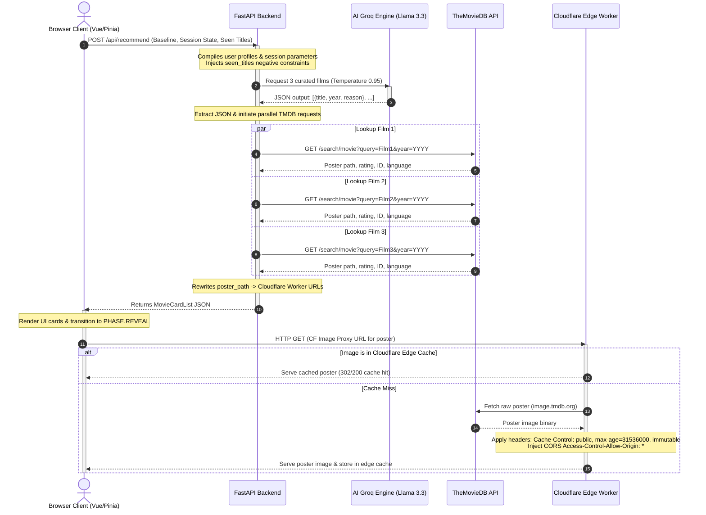
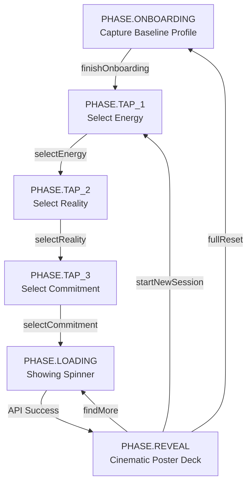
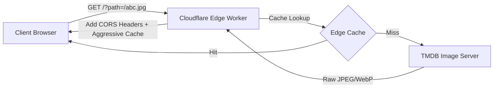

# Inside Socrates Screen: Deep Technical Curation Engine

Socrates Screen is an AI-driven, hyper-personalized movie curation application. Unlike generic recommendation engines that rely on static collaborative filtering or basic genre tags, Socrates Screen decodes a user's **current psychological state** and intersects it with their **persistent baseline preferences** to recommend exactly **3 perfect films** from the entire canvas of global cinema.

This document provides a highly comprehensive, step-by-step technical breakdown of how the frontend, backend, and Cloudflare Edge Proxy function together.

---

## 1. Directory Structure

The project is structured into three clean, isolated modules to maintain clear boundaries between the frontend application, the API backend, and the serverless edge worker.

```text
socrates-screen/
├── backend/                  # FastAPI Application Layer
│   ├── .env                  # API keys and endpoint variables
│   ├── main.py               # API routing, TMDB fetching, connection pooling
│   ├── llm_service.py        # LLM client integration, prompts, JSON extractors
│   └── requirements.txt      # Python dependencies
├── frontend/                 # Vue 3 UI Layer (Vite + Pinia)
│   ├── src/
│   │   ├── stores/
│   │   │   └── store.js      # Pinia State Store (baseline & session management)
│   │   ├── App.vue           # Cinematic single-page UI container
│   │   ├── main.js           # Vue mounting and bootstrapping
│   │   └── style.css         # Modern typography and glassmorphic aesthetics
│   ├── vite.config.js        # Vite build tool and development server configuration
│   └── package.json          # Node dependencies and build scripts
└── worker/                   # Cloudflare Edge Worker Layer
    ├── index.js              # Serverless TMDB image proxy & aggressive cache
    └── wrangler.toml         # Cloudflare Deployment configuration
```

---

## 2. Architecture & Data Flow

The system operates as an asynchronous pipeline. Below is a structural map of how requests originate from the browser, process through the backend, consult the LLM and the TMDB database, and leverage the Cloudflare Edge Cache.



---

## 3. Data Schemas & API Payloads

The communication boundary between the frontend and backend is strictly typed using Pydantic V2 models on the server side and reactive JSON structures on the client.

### Request Payload (`POST /api/recommend`)
Sent by the Pinia store when the user completes their third selection tap.

```json
{
  "baseline_profile": {
    "favorite_movies": ["Inception", "Kumbalangi Nights", "3 Idiots"],
    "favorite_genres": ["Sci-Fi", "Drama", "Thriller"],
    "dealbreakers": ["gore", "horror"],
    "preferred_language": "any"
  },
  "session_state": {
    "energy": "think",
    "reality": "escapism",
    "commitment": "quick"
  },
  "seen_titles": ["Interstellar", "Coherence"]
}
```

### Response Payload (`MovieCardList`)
Returned by FastAPI after LLM extraction, parallel TMDB search, and edge URL transformation.

```json
{
  "films": [
    {
      "title": "Ex Machina",
      "year": "2014",
      "reason": "An intensely cerebral and grounded thriller under two hours that explores the boundaries of artificial intelligence. It perfectly matches your desire to think while offering a highly atmospheric escape.",
      "poster_url": "https://socrates-image-proxy.example.workers.dev/?path=%2F8naVv2Xu3rWI5JKHz0vCujx6GaJ.jpg",
      "tmdb_id": 264660,
      "original_language": "en",
      "vote_average": 7.6
    },
    {
      "title": "Primer",
      "year": "2004",
      "reason": "A mind-bending puzzle box of a time-travel film. Clocking in at a tight 77 minutes, it offers a cerebral workout that will leave you tracing timelines long after it ends.",
      "poster_url": "https://socrates-image-proxy.example.workers.dev/?path=%2F5sV6dJjBshvV92kU6k3yP21j1Uv.jpg",
      "tmdb_id": 14337,
      "original_language": "en",
      "vote_average": 6.9
    },
    {
      "title": "The Man from Earth",
      "year": "2007",
      "reason": "A brilliant chamber drama that takes place entirely in a single cabin. It is a profound, high-concept conversational movie that stretches the mind without needing a single special effect.",
      "poster_url": "https://socrates-image-proxy.example.workers.dev/?path=%2F2WbZ37i8mI4tF4PuxqA7xJm70fB.jpg",
      "tmdb_id": 13342,
      "original_language": "en",
      "vote_average": 7.7
    }
  ]
}
```

---

## 4. The Frontend Layer (Vue 3 + Pinia)

The frontend orchestrates the visual state machine and holds the user preferences in persistent browser storage.

### Persistent Baseline Profile
During onboarding, the user registers their baseline taste. Pinia maps this to a persistent `localStorage` object under the key `socrates_baseline_v1`. 

* **Store File:** `frontend/src/stores/store.js`
* **Loading & Saving:** The helper `loadBaseline()` retrieves the saved JSON on store initialization. When onboarding is complete, `finishOnboarding()` invokes `saveProfile()`, storing the configurations permanently so users skip onboarding on subsequent visits.

### Ephemeral Session State
A 3-axis selector maps the psychological and temporal constraints:
1. **Energy** (`think` | `brain_off` | `feel`): Maps to cognitive processing desires.
2. **Reality** (`grounded` | `escapism`): Determines literal/realist versus fantasy/speculative environments.
3. **Commitment** (`quick` | `epic`): Limits or expands runtimes (under 110 mins vs. 130+ mins).

### The UI State Machine
The client switches UI states seamlessly using the reactive `phase` variable, ensuring clean division of labor:



### Seen Titles Deduplication Loop
To prevent the user from receiving repetitive recommendations in the same session, the frontend keeps an active array `seenTitles` in store memory.

* When the user clicks **"Find 3 More"**, the action `findMore()` is invoked:
  ```javascript
  async function findMore() {
    if (recommendation.value?.length) {
      for (const film of recommendation.value) {
        if (!seenTitles.value.includes(film.title)) {
          seenTitles.value.push(film.title);
        }
      }
    }
    await fetchRecommendation();
  }
  ```
* These titles are included in the request payload as `seen_titles`. This persistent exclusion array grows dynamically during the session.

---

## 5. The Backend Layer (FastAPI + Groq / Cerebras)

The backend provides the API service layer. It decodes user states, communicates with high-performance LLMs, queries TMDB in parallel, and crafts custom image proxy targets.

### Connection Pooling & Lifespan
Because recommendations happen dynamically, opening a new HTTP connection for each metadata query would add hundreds of milliseconds of latency.
* The API utilizes FastAPI's `lifespan` manager to initialize a single, high-performance `httpx.AsyncClient` with connection pooling limits:
  ```python
  _http_client = httpx.AsyncClient(
      timeout=httpx.Timeout(10.0, connect=5.0),
      limits=httpx.Limits(max_keepalive_connections=20, max_connections=50),
  )
  ```
* This client is shared across all TMDB API searches, guaranteeing ultra-low-latency keep-alive connections.

### AI Engine Curation & Negative Constraints
The LLM (by default, LLaMA 3.3 70B on Groq or LLaMA 3.1 70B on Cerebras) acts as an opinionated film curator.
* **Negative Constraints Integration:** To make the LLM respect the `seen_titles` array, the system dynamically appends a loud directive inside `llm_service.py`:
  ```text
  CRITICAL INSTRUCTION - ALREADY SEEN FILMS:
  The user has already been recommended the following films in this session:
  - Film A
  - Film B
  
  DO NOT recommend these films again. You MUST pick 3 completely different films. If you repeat any of the films listed above, you have failed your objective.
  ```
* **Forcing Creativity:** To guarantee that the LLM does not get stuck in a structural loop, the API generation temperature is bumped to `0.95`. This provides high randomness and diverse choices while ensuring output conforms to the structured JSON template via `response_format={"type": "json_object"}`.

### Parallel Metadata Hydration (`asyncio.gather`)
The LLM only knows titles and years. To retrieve poster paths, ratings, and language metadata, the backend executes three concurrent queries in parallel:

```python
# Launch 3 search queries concurrently on the event loop
tmdb_results = await asyncio.gather(
    *[_search_tmdb(r.title, r.year) for r in llm_results]
)
```
Rather than querying TMDB sequentially (which would take $3 \times \text{RTT}$), the asynchronous pool resolves all metadata in the time of a single request.

---

## 6. The Edge Proxy Layer (Cloudflare Workers)

Direct lookups to TMDB's image servers (`image.tmdb.org`) face major real-world bottlenecks:
* **ISP Blocking:** Several major Indian ISPs (such as Reliance Jio, ACT Fibernet, and BSNL) blackhole TMDB's DNS/IP subnets, leading to broken images for local users.
* **CORS Restrictions:** Serving raw images directly to canvas elements or modern DOM elements can trigger browser Cross-Origin Resource Sharing (CORS) exceptions.

To bypass these hurdles, Socrates Screen deploys a global Edge Worker.



### Key Mechanisms:
1. **CORS Injection:** The worker strips original restrictive headers and adds permissive CORS entries dynamically:
   ```javascript
   function corsHeaders(origin) {
     return {
       "Access-Control-Allow-Origin": origin || "*",
       "Access-Control-Allow-Methods": "GET, HEAD, OPTIONS",
       "Access-Control-Allow-Headers": "Content-Type, Accept",
       "Access-Control-Max-Age": "86400",
     };
   }
   ```
2. **Aggressive Cache Layering:** To reduce burden on TMDB and secure instantaneous response times, the worker caches images directly in Cloudflare's global POPs using the standard Cache API (`caches.default`):
   ```javascript
   responseHeaders.set("Cache-Control", "public, max-age=31536000, immutable");
   ```
   This guarantees that a poster requested by any user worldwide is cached at the edge forever, serving subsequent users in under 10ms.

---

## 7. Lifecycle of a Single Request

When a user selects **"Move Me"** (Feel), **"Take Me Away"** (Escapism), and **"Under Two Hours"** (Quick), this is what happens behind the scenes:

1. **Client Action:** The user presses the final option card.
2. **State Preparation:** The Pinia store collects baseline parameters from `localStorage` along with the tap inputs. It builds the `payload` and triggers a `POST` request to `http://localhost:8000/api/recommend`.
3. **Backend Parsing:** The FastAPI application parses the incoming request through the `RecommendPayload` Pydantic model.
4. **LLM Invocation:** `llm_service.py` is invoked. It builds the system prompt and injects user variables. The prompt is sent to Groq's high-speed API running LLaMA 3.3.
5. **AI Reasoning:** The model selects three suitable films under 110 minutes that match an emotionally resonant, fantastical escape (e.g., *Spirited Away*, *The Fountain*, *About Time*).
6. **JSON Extraction:** The backend receives the raw response, removes any Markdown wrappers using regular expressions, loads the clean string into a Python dictionary, and maps them to Pydantic outputs.
7. **TMDB Hydration:** The backend fires off 3 concurrent asynchronous requests using HTTPX to TMDB Search API to find matches for the titles and years.
8. **Worker Link Conversion:** For each match, the backend takes TMDB's relative path (`/39OI2j2Gc285gH6wSqxCOv5lh9z.jpg`) and constructs the Cloudflare Worker URL, transforming it into `https://socrates-image-proxy.example.workers.dev/?path=/39OI2j2Gc285gH6wSqxCOv5lh9z.jpg`.
9. **Payload Delivery:** The API responds with the `MovieCardList` JSON structure.
10. **Cinematic Reveal:** The frontend transitions from `PHASE.LOADING` to `PHASE.REVEAL`. A sleek glassmorphic deck renders the poster assets, fetching the images through the Cloudflare worker proxy, bypassing network blocks immediately. Users can click on any movie title card to navigate directly to its official page on TheMovieDB.

